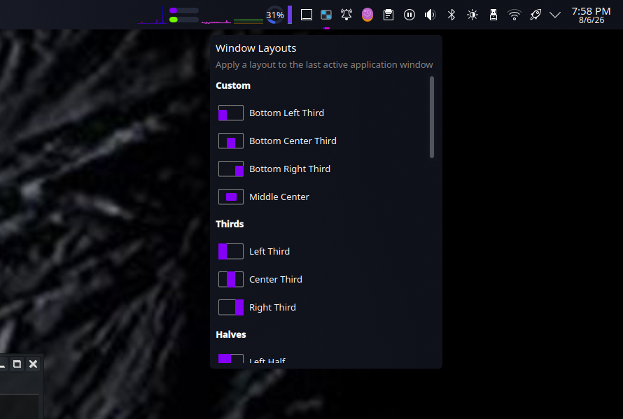
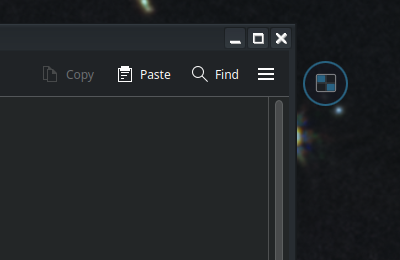
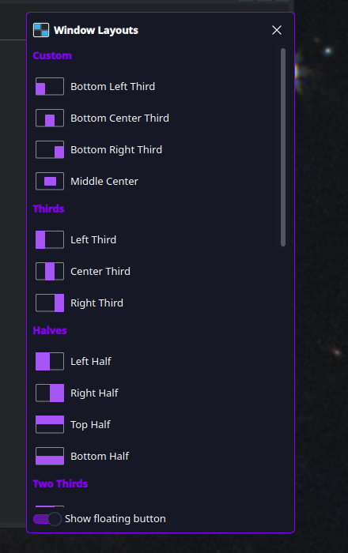
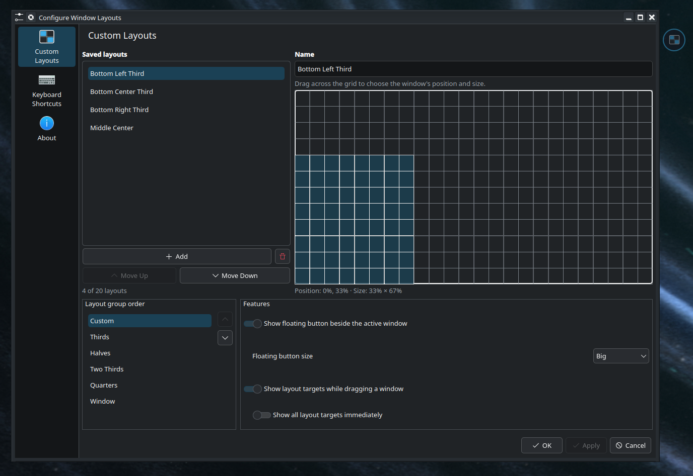
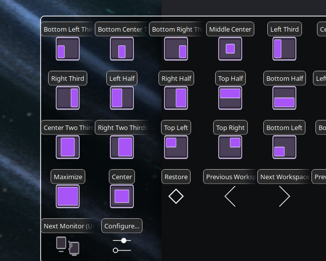

# Window Layouts for KDE Plasma

Window Layouts is a window-positioning/tiling application inspired by Magnet (on MacOS) for **KDE Plasma 6 on Wayland**. It provides an extensive amount of customisation for organising windows on your desktop -- gives you named layouts for the focused (active) window including the familiar halves and quarters as well as the ability to customise up to 20 layouts that adapt to each monitor's usable area.

The project is designed for a native Wayland Plasma session: KWin moves the
application window itself, so it does not inject buttons into application title
bars or rely on X11 window-management tools.

## Features

- Fixed halves, quarters, thirds, two-thirds, maximize, center, and restore
  layouts.
- Up to 20 named custom layouts, selected on a 24 × 12 visual grid.
- A panel widget, a floating button beside the focused window, and an optional
  Cairo-Dock sub-dock that all invoke the same KWin actions.
- Move the focused window to the next or previous monitor and workspace, with
  wrap-around. Commands are unavailable when there is nowhere to move.
- Optional on-screen layout targets while dragging a window, with either
  proximity-based or immediate display of all targets.
- Reorder layout groups: Halves, Quarters, Thirds, Two Thirds, Custom, and
  Window.
- Per-window Restore geometry, so a laid-out window can return to its previous
  size and position.
- Settings shared between the panel, floating button, Cairo-Dock, and the
  configuration windows.

## Screenshots

The sample custom-layout names shown below are illustrative only. A fresh
installation starts with an empty custom-layout list, ready for your own
layouts.

### Panel widget

<p align="center">
  <a href="screenshots/readme/panel-menu.png"></a>
</p>

### Floating button

<p align="center">
  <a href="screenshots/readme/floating-button.png"></a>
  <a href="screenshots/readme/floating-button-menu.png"></a>
</p>

### Custom-layout configuration

<p align="center">
  <a href="screenshots/readme/configuration.png"></a>
</p>

### Optional Cairo-Dock integration

<p align="center">
  <a href="screenshots/readme/cairo-dock-subdock.png"></a>
</p>

## Requirements

### Core requirements

- Fedora KDE Plasma 44 or another Plasma 6 + KWin 6 Wayland session.
- Python 3, GTK 3, Python GObject bindings, and Python D-Bus bindings for the
  shared configuration window.
- The following commands: `kpackagetool6`, `kreadconfig6`, `kwriteconfig6`,
  `qdbus-qt6`, `qtpaths6`, and `kscreen-doctor`.

Most of these are already installed on Fedora KDE. On Fedora 44, install any
missing core dependencies with:

```bash
sudo dnf install \
  kf6-kpackage kf6-kconfig qt6-qttools qt6-qtbase libkscreen \
  plasma-workspace python3-gobject python3-dbus gtk3
```

### Optional Cairo-Dock requirements

The Cairo-Dock frontend also needs:

```bash
sudo dnf install cairo-dock cairo-dock-plug-ins-dbus cairo-dock-python3
```

## Install

Clone or download this repository, open a terminal in the project directory,
then install the core Window Layouts components into your user account:

```bash
cd window-layouts-kde
./install.sh
./place-on-panel.sh
```

`install.sh` installs the KWin actions, panel widget, floating-button package,
drag-target package, and shared configuration service. The floating button and
drag targets are intentionally disabled on a fresh install; enable them from
the configuration window when you are ready to use them.

`place-on-panel.sh` adds Window Layouts to a Plasma panel on the primary
screen. It removes only existing Window Layouts widgets from desktop
containments, which prevents an accidental desktop widget while leaving all
other widgets untouched.

You can also add the widget manually through **Edit Mode** on a panel → **Add
Widgets** → **Window Layouts**. Adding it from the desktop widget browser adds
it to the desktop instead of a panel.

## Configure Window Layouts

Click the Window Layouts panel icon and choose **Configure…** to open up the configuration window. The same shared configuration window is also available from the Cairo-Dock applet and the floating-button menu.

Use it to:

1. Add, name, remove, and reorder up to 20 custom layouts.
2. Drag across the 24 × 12 grid to set a custom layout's proportional position
   and size.
3. Reorder the layout groups shown by the menus and drag targets.
4. Enable or disable the floating button and on-screen drag targets.
5. Choose whether drag targets appear near the matching screen region or all
   appear immediately.
6. Choose the floating-button size: Small, Default, Big, or Extra big.

Choose **Apply** to apply the setting changes and keep editing, **OK** to apply the setting changes and close the configuration window, or **Cancel** to discard unapplied changes. Custom layouts are proportional to each display's usable area, so they remain useful across different resolutions and panel
configurations.

## Using Window Layouts

### Panel widget

Click the panel icon, then choose a layout for the focused application window.
The menu also provides Restore, workspace movement, monitor movement, and
Configure options. Monitor and workspace movement wraps at each end of the available list.

### Floating button

When enabled, the compact blue button follows an eligible focused window near
its upper edge. It moves to the left side when the window is too close to the
right edge of its display. Click it to open the same layout menu used by the
panel.

The floating button is hidden for the desktop, minimized windows, maximized
windows, full-screen windows, and special or non-resizable windows. Its menu
also includes a **Show floating button** switch, so it can be disabled quickly
if needed. Re-enable it through **Configure Window Layouts** from the panel or
Cairo-Dock.

KWin also registers an unassigned shortcut named **Window Layouts: Toggle
Floating Menu**. Assign a key sequence in System Settings if you prefer a
keyboard shortcut.

### On-screen drag layouts

When enabled, start moving a normal window with the mouse. Layout targets are
shown either when the pointer approaches a layout region or immediately,
depending on your configuration. Hovering a target previews the destination;
release the mouse over it to apply that layout.

### Cairo-Dock frontend

Install the optional Cairo-Dock integration with:

```bash
./install-cairo-dock.sh
```

Then enable **Window Layouts** in **Cairo-Dock Configuration → Add-ons**. The
applet opens a sub-dock with layout previews and the same window actions. It
refreshes when monitors or workspaces change, and monitor entries are visibly
unavailable when only one monitor is connected.

The installer adds a small user-session guard to keep Cairo-Dock on KDE's
primary output after display changes and unlocks. It works with Cairo-Dock's
existing autostart service and does not start a duplicate dock.

## Updating and uninstalling

For panel, floating-button, drag-target, shared configurator, or Cairo-Dock
source changes, run:

```bash
./install-drag-overlay.sh
```

This upgrades those packages while preserving the
floating-button, drag-target, size, and group-order settings already selected.

For changes to the core JavaScript KWin action script, run `./install.sh`.
That script is a clean core install and intentionally resets the optional
floating-button and drag-target settings to their safe defaults.

To remove the core components and panel widget:

```bash
./uninstall.sh
```

The optional Cairo-Dock add-on can be disabled from **Cairo-Dock Configuration
→ Add-ons**. A dedicated Cairo-Dock cleanup script is planned as part of the
packaging work.

## Troubleshooting

If layouts do not move a window, check **System Settings → Window Management →
KWin Scripts** and confirm **Window Layouts** is enabled. Useful logs are:

```bash
journalctl --user -f | grep -E 'window-layouts|windowlayouts'
```

If the optional floating button ever prevents normal input, switch to a virtual
terminal and disable it:

```bash
kwriteconfig6 --file kwinrc --group Plugins \
  --key windowlayoutsfloatingbuttonEnabled --type bool false
qdbus-qt6 org.kde.KWin /Scripting \
  org.kde.kwin.Scripting.unloadScript windowlayoutsfloatingbutton
qdbus-qt6 org.kde.KWin /KWin reconfigure
```

## Support, bugs, and contributions

Please report bugs, feature requests, and reproducible problems through the
[GitHub Issues tracker](../../issues). Include your Plasma/KWin version,
Fedora version, display setup, steps to reproduce the issue, and relevant log
output where possible.

You can also reach the maintainer through the
[baddison2005 GitHub profile](https://github.com/baddison2005).

If Window Layouts has been useful to you, please consider supporting its
development through [GitHub Sponsors](https://github.com/sponsors/baddison2005).
Thank you so much!

## Project internals

For the component map, persisted settings, important functions, and extension
notes, see [docs/ARCHITECTURE.md](docs/ARCHITECTURE.md).

## License

Window Layouts is distributed under **GPL-3.0-or-later**. The QML and
JavaScript files are marked GPL-2.0-or-later, which permits distribution under
GPLv3; the Python components are GPL-3.0-or-later. See the SPDX headers in the
source files for the applicable file-level notices. The complete license text
is available in [LICENSE](LICENSE).
